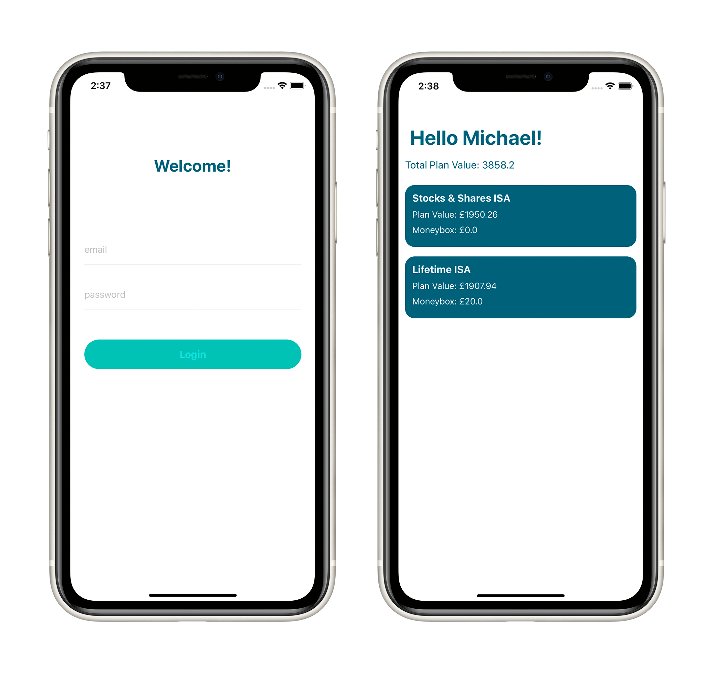

    

# MoneySafe

A simple iOS application that uses the Moneybox API to login and display some resources.

## App Requirements
Before running the app either in the simulator or on a device:
- For this technical challenge, NVActivityIndicatorView has been used through Cocoapods. Make sure to run 'pod install' to install the necessary pods.

In order to log into the app, you will need to use the following user:
- Username: test+ios@moneyboxapp.com
- Password: P455word12

## Technical Requirements
- Demonstration of coding style, conventions, structure and use of any 3rd party libraries.
- Use of storyboards and autolayout.
- Any form of unit testing would be a bonus.
- The application must run on iOS 11 or later.
- The application must compile and run on Xcode and be debugged in Xcode's iOS simulator.